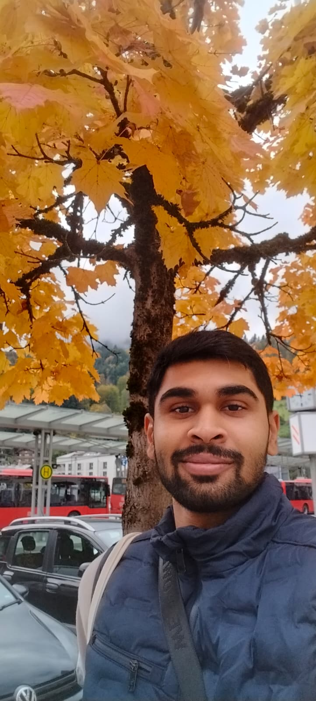
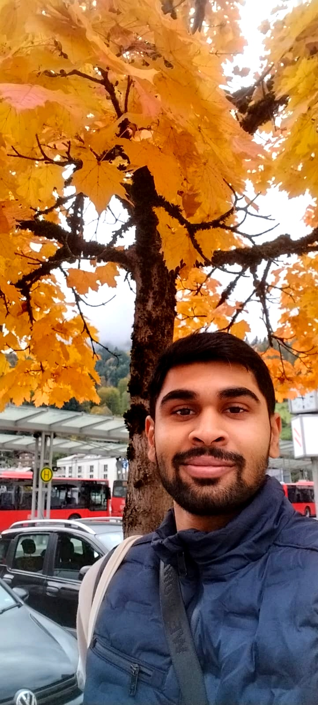

# Automated Image Enhancer

Automated Image Enhancer is a **Python project** that allows users to **bulk enhance photos**. It is perfect for:

- Post-processing **wedding photos**
- Editing a batch of **Instagram images**
- Quickly improving any set of images for social media or personal projects

The project uses the **[Pillow](https://pillow.readthedocs.io/en/stable/) library**, a powerful Python imaging library, to apply enhancements such as:

- Color saturation boost  
- Contrast adjustment  
- Sharpness improvement  
- Brightness tuning  
- Optional filters like sharpening and detail enhancement

-----

## Before and After Example

<p float="left">
  
  
</p>

----
## Setup Instructions

Follow these steps to set up and run the **Automated Image Enhancer** project:

1. **Clone the GitHub repository** into your project folder:
   
```bash
git clone git@github.com:Belvin7/Automated_Image_Enhancer_Project.git
cd Automated_Image_Enhancer_Project
```
2.Create and activate a virtual environment:

- Linux/macOS
```bash
python3 -m venv venv
source venv/bin/activate
```
- Windows
```bash
python -m venv venv
venv\Scripts\activate
```
3.Install Pillow, the Python imaging library:

Detailled instructions on this given [here](https://pillow.readthedocs.io/en/stable/installation/basic-installation.html)

4. Run the script
```bash
python photoEditor.py
```


